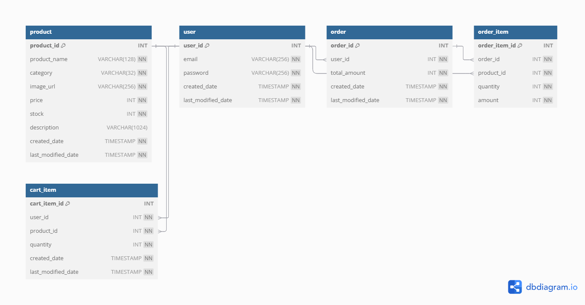

# Springboot Mall 線上商城後端系統

一個使用 Spring Boot 架構的簡易 RESTful API，提供用戶註冊、商品管理、訂單建立等功能，適合學習與練習電商系統後端開發。

---

## 專案目標

- 練習使用 Spring Boot 建立電商後端 RESTful API
- 掌握 Controller → Service → DAO 的三層架構設計
- 實作會員註冊、商品 CRUD、訂單建立與查詢功能
- 具備擴充性、測試性、部署性之實務專案

---

##  專案亮點

-  分層式 MVC 架構，清晰分離 Controller、Service、DAO
-  採用 Spring JDBC Template + RowMapper，自行撰寫 SQL 邏輯
-  Hibernate Validator 表單驗證，確保資料正確性
-  整合 JUnit + Spring Boot Test + H2 測試資料庫
-  RESTful API 設計原則，支援標準錯誤處理與例外格式
-  清晰命名的 DTO 類型（如 `CreateOrderRequest`, `BuyItem`）


---

##  技術棧（Tech Stack）

| 類別         | 技術                                         |
|--------------|----------------------------------------------|
| Language     | Java 17+                                     |
| Framework    | Spring Boot, Spring MVC, Spring JDBC         |
| Build Tool   | Maven                                         |
| Database     | MySQL（本地） + H2（測試）                     |
| Others       | Hibernate Validator, JUnit, Talend API Tester     |

---

## 安裝與運行指南

### 系統需求

- Java 17+
- Maven 3.8+
- MySQL 資料庫

###  安裝步驟

```bash
git clone https://github.com/your-username/springboot-mall.git
cd springboot-mall
```

###  設定資料庫連線

在 `src/main/resources/application.properties` 中設定連線參數：

```properties
spring.datasource.url=jdbc:mysql://localhost:3306/mall
spring.datasource.username=root
spring.datasource.password=yourpassword
```

###  啟動專案

```bash
mvn spring-boot:run
```

預設啟動網址：`http://localhost:8080`

---

##  API 文件

###  使用者相關

| 方法 | 路徑               | 功能         |
|------|--------------------|--------------|
| POST | `/users/register`  | 註冊使用者   |
| GET  | `/users/{id}`      | 查詢使用者   |

###  商品相關

| 方法 | 路徑                  | 功能         |
|------|-----------------------|--------------|
| GET  | `/products`           | 商品清單     |
| GET  | `/products/{id}`      | 單一商品查詢 |
| POST | `/products`           | 新增商品     |
| PUT  | `/products/{id}`      | 更新商品     |
| DELETE | `/products/{id}`    | 刪除商品     |

### 訂單相關

| 方法 | 路徑               | 功能         |
|------|--------------------|--------------|
| POST | `/orders`          | 建立訂單     |
| GET  | `/orders/{id}`     | 查詢訂單     |

---

##  專案結構與架構說明

```
src/
└── main/
    └── java/
        └── com.jensen.springbootmall/
            ├── controller/   // API 控制層
            ├── service/      // 商業邏輯層
            ├── repository/   // 資料庫操作層
            └── model/        // 資料模型（Entity）
```

- 架構設計：MVC 分層設計，Controller → Service → Repository

---

##  資料庫結構（ER圖）

下圖為本專案的資料庫設計之 ER圖（Entity-Relationship Diagram，實體關係圖）。

它清楚地展示了專案中主要資料表之間的關係與欄位結構：

- `user`：用戶註冊資訊，包括 email、密碼與建立/修改時間
- `product`：商品資訊，包含名稱、分類、價格、庫存與描述
- `order`：訂單主表，紀錄下訂用戶與總金額
- `order_item`：訂單明細，每筆訂單可包含多項商品

資料表之間的邏輯關聯如下：
- 一位使用者（user）可以有多筆訂單（order） ➜ 1:N
- 一張訂單（order）可以對應多筆明細（order_item） ➜ 1:N
- 一筆明細（order_item）對應一項商品（product） ➜ N:1

> 🔍 注意：目前資料表中並未使用 `FOREIGN KEY` 明確定義外鍵關聯，但 ER 圖仍依照欄位命名邏輯推論出其資料流與結構關係。



## 主要功能特色

✅ 使用者註冊與查詢  
✅ 商品 CRUD 管理  
✅ 建立訂單與訂單查詢  
✅ 基礎資料驗證與錯誤處理  

---

## 測試資訊

- 使用 JUnit + Spring Boot Test 撰寫後端整合測試
- 使用 H2 資料庫模擬測試環境
- 🔍 API 測試工具：**Talend API Tester**

> Talend API Tester 是一款專業的 RESTful API 測試工具（Chrome 擴充套件），可用來驗證 API 端點的請求與回應格式是否正確。  
> 支援 POST/GET/PUT/DELETE 測試、Header 設定、JSON Body 傳送、自動保存測試案例等功能。


## 可擴充功能規劃（Future Work）

 JWT 登入驗證與角色權限控管

 商品搜尋與價格篩選（搭配分頁與排序）

 加入購物車功能、結帳流程

 整合 Swagger/OpenAPI 自動生成文件

雲端部署 Render / Railway / Docker 容器化

 訂單狀態追蹤與歷史查詢


